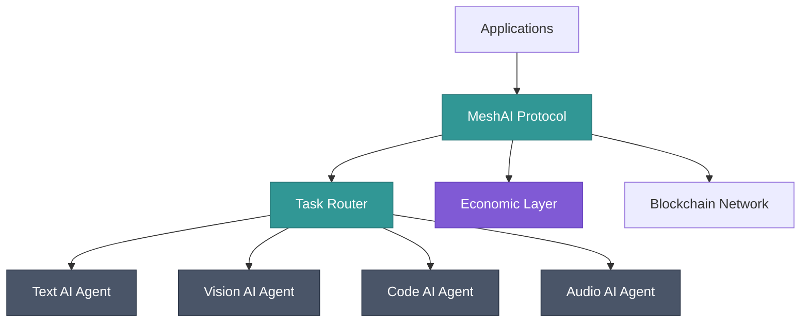
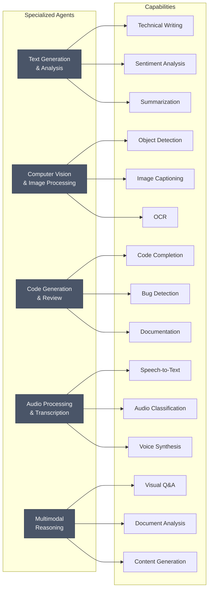
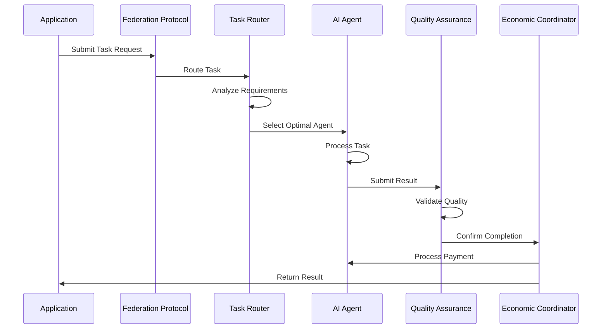
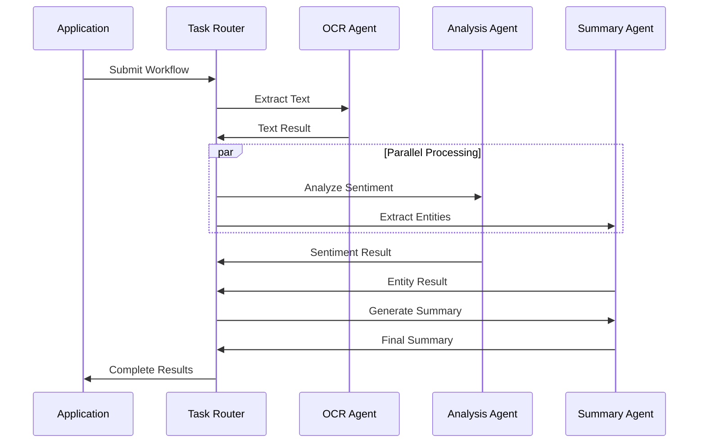

## System Overview

MeshAI Protocol operates as a four-layer decentralized system that enables seamless AI collaboration through standardized protocols and intelligent routing.



### Architecture Layers

<CardGroup cols={2}>
  <Card title="Application Layer" icon="computer">
    Web apps, mobile apps, and enterprise systems that consume AI services
  </Card>
  <Card title="Protocol Layer" icon="network-wired">
    MeshAI Protocol handles routing, quality assurance, and coordination
  </Card>
  <Card title="Agent Layer" icon="robot">
    Specialized AI agents that process specific types of tasks
  </Card>
  <Card title="Infrastructure Layer" icon="server">
    Blockchain network, P2P communication, and distributed storage
  </Card>
</CardGroup>

## Core Components

### Application Layer

The top layer consists of client applications that consume AI services through MeshAI Protocol:

<CardGroup cols={2}>
  <Card title="Web Applications" icon="globe">
    Frontend applications using JavaScript SDK for real-time AI integration
  </Card>
  <Card title="Enterprise Systems" icon="building">
    Backend services integrating Python/Go SDKs for scalable AI workflows
  </Card>
  <Card title="Mobile Applications" icon="mobile">
    iOS and Android apps leveraging edge AI capabilities through the network
  </Card>
  <Card title="Developer Tools" icon="code">
    IDEs, CLI tools, and development environments with AI assistance
  </Card>
</CardGroup>

### Protocol Layer

The core coordination layer that makes decentralized AI collaboration possible:

#### Federation Protocol
Enables standardized communication between heterogeneous AI systems using:

- **Message Format**: JSON-based protocol with cryptographic signatures
- **Capability Discovery**: Decentralized registry of agent capabilities and performance
- **Authentication**: Public-key cryptography for secure agent identification
- **Routing Tables**: Distributed hash tables for efficient agent lookup

```python
# Example federation message
{
  "protocol_version": "1.0",
  "task_id": "uuid",
  "sender": {
    "agent_id": "text-specialist-v2",
    "endpoint": "https://agent.example.com"
  },
  "task": {
    "type": "text_generation",
    "input": "Generate technical documentation",
    "constraints": {
      "max_tokens": 2000,
      "quality_threshold": 0.95
    }
  },
  "signature": "cryptographic_signature"
}
```

#### Task Router
Intelligent distribution system that optimizes task assignment based on:

<Accordion title="Agent Specialization">
Matches tasks to agents with proven expertise in specific domains. Text generation tasks route to specialized language models, while image analysis goes to computer vision specialists.
</Accordion>

<Accordion title="Quality Metrics">
Historical performance data including accuracy scores, user ratings, and completion rates influence routing decisions to ensure high-quality results.
</Accordion>

<Accordion title="Performance Optimization">
Real-time metrics like latency, throughput, and current load balance tasks across available agents for optimal response times.
</Accordion>

<Accordion title="Economic Factors">
Cost optimization considers agent pricing, user budgets, and value-for-money ratios to route tasks economically.
</Accordion>

#### Quality Assurance Network
Decentralized validation system ensuring result reliability:

- **Multi-dimensional Scoring**: Accuracy, completeness, consistency, and format compliance
- **Consensus Mechanisms**: Multiple validators cross-check critical results
- **Reputation Tracking**: Long-term quality trends influence future routing decisions
- **Automated Validation**: ML models detect anomalies and quality issues

#### Economic Coordinator
Manages payments, incentives, and network economics:

- **Micropayment Channels**: Solana-based instant payments for task completion
- **Dynamic Pricing**: Market-driven pricing based on demand and agent performance
- **Reward Distribution**: Quality bonuses and network participation incentives
- **Stake Management**: Agent deposit tracking and slashing for malicious behavior

### Agent Layer

Specialized AI services that process specific types of tasks:



### Infrastructure Layer

Foundational services enabling decentralized operation:

<CardGroup cols={2}>
  <Card title="Blockchain Network" icon="link">
    Solana-based infrastructure for payments, governance, and agent registration
  </Card>
  <Card title="P2P Communication" icon="network-wired">
    Distributed networking using libp2p for direct agent-to-agent communication
  </Card>
  <Card title="Distributed Storage" icon="database">
    IPFS integration for storing large models, datasets, and computation results
  </Card>
  <Card title="Network Monitoring" icon="chart-line">
    Real-time observability for network health, performance, and security
  </Card>
</CardGroup>

## Data Flow Architecture

### Single Task Execution



### Multi-Agent Workflow



## Network Topology

### Hybrid Architecture

MeshAI implements a hybrid network topology combining benefits of different approaches:

<Tabs>
  <Tab title="Hub-and-Spoke">
    **Initial Discovery**: New agents and tasks use hub nodes for bootstrapping and capability discovery.
    
    **Benefits**: Simplified onboarding, centralized reputation tracking, easy network monitoring.
  </Tab>
  
  <Tab title="Mesh Network">
    **Direct Communication**: Established agents communicate directly for reduced latency and improved resilience.
    
    **Benefits**: No single point of failure, improved performance, better scalability.
  </Tab>
  
  <Tab title="Hierarchical Clusters">
    **Geographic Organization**: Agents cluster by region and capability type for optimal routing.
    
    **Benefits**: Reduced latency, improved fault isolation, better resource utilization.
  </Tab>
</Tabs>

### Network Resilience

<CardGroup cols={3}>
  <Card title="Fault Tolerance" icon="shield-check">
    Automatic failover to backup agents when primary agents become unavailable
  </Card>
  <Card title="Load Distribution" icon="loader">
    Dynamic load balancing prevents any single agent from becoming overwhelmed
  </Card>
  <Card title="Self-Healing" icon="wrench">
    Network automatically detects and routes around failed or malicious nodes
  </Card>
</CardGroup>

## Security Architecture

### Multi-Layer Security

<Accordion title="Cryptographic Identity">
All agents maintain Ed25519 keypairs for identity verification. Every message is cryptographically signed, preventing impersonation and ensuring message integrity.
</Accordion>

<Accordion title="Secure Execution">
Tasks execute in isolated environments with strict resource limits. Sandboxing prevents malicious agents from accessing unauthorized data or consuming excessive resources.
</Accordion>

<Accordion title="Economic Security">
Stake-based participation requires agents to deposit tokens proportional to their transaction volume. Malicious behavior results in stake slashing, creating strong economic disincentives for attacks.
</Accordion>

<Accordion title="Privacy Protection">
End-to-end encryption protects sensitive data in transit. Zero-knowledge proofs enable computation verification without revealing underlying data.
</Accordion>

## Scalability Design

### Horizontal Scaling

The architecture supports massive scale through several mechanisms:

**Geographic Distribution**: Regional clusters reduce latency and improve fault isolation while maintaining global connectivity.

**Capability Sharding**: Different agent types can scale independently based on demand patterns for their specific capabilities.

**Elastic Infrastructure**: Cloud-native design enables automatic scaling of protocol layer components based on network load.

**Efficient Routing**: Distributed hash tables and caching reduce coordination overhead as the network grows.

### Performance Optimization

<CardGroup cols={2}>
  <Card title="Connection Pooling" icon="plug">
    Persistent connections reduce handshake overhead for frequently communicating agents
  </Card>
  <Card title="Result Caching" icon="memory">
    Frequently requested computations are cached to reduce redundant processing
  </Card>
  <Card title="Batch Processing" icon="layer-group">
    Similar tasks are batched together for more efficient processing by specialized agents
  </Card>
  <Card title="Predictive Scaling" icon="chart-line">
    Machine learning models predict demand patterns to preemptively scale capacity
  </Card>
</CardGroup>

## Integration Patterns

### SDK Integration

<CodeGroup>

```python Python
from meshai import MeshAI

# Initialize client with automatic service discovery
client = MeshAI(
    api_key="your_key",
    auto_discover=True,
    preferred_regions=["us-east", "eu-west"]
)

# Intelligent routing handles complexity
result = client.execute_task(
    task_type="document_analysis",
    input=document_data,
    quality_threshold=0.95
)
```

```javascript JavaScript
import { MeshAI } from 'meshai-sdk';

// Browser-optimized client
const client = new MeshAI({
  apiKey: 'your_key',
  enableCaching: true,
  preferredLatency: 'low'
});

// Automatic agent selection
const result = await client.executeTask({
  taskType: 'text_generation',
  input: prompt,
  streaming: true
});
```

</CodeGroup>

### Direct Agent Integration

```python
from meshai.agent import BaseAgent

class CustomAgent(BaseAgent):
    async def process_task(self, task):
        # Custom AI processing logic
        result = await self.model.generate(task.input)
        
        return {
            "output": result.text,
            "confidence": result.confidence,
            "metadata": {
                "model_version": "v2.1",
                "processing_time": result.latency
            }
        }

# Register with network
agent = CustomAgent()
await agent.join_network(
    capabilities=["text_generation", "creative_writing"],
    stake_amount=10000  # MESH tokens
)
```

## Monitoring and Observability

### Network Health Metrics

<CardGroup cols={4}>
  <Card title="Task Throughput" icon="gauge">
    Real-time monitoring of tasks processed per second across the network
  </Card>
  <Card title="Agent Availability" icon="circle-check">
    Percentage of registered agents currently online and accepting tasks
  </Card>
  <Card title="Quality Scores" icon="star">
    Average quality ratings across different task types and agent categories
  </Card>
  <Card title="Network Latency" icon="clock">
    End-to-end response times including routing, processing, and validation
  </Card>
</CardGroup>

### Performance Analytics

The protocol layer provides comprehensive analytics for optimization:

- **Routing Efficiency**: Success rates and fallback frequency for routing decisions
- **Agent Performance**: Individual agent metrics including uptime, quality, and earnings
- **Cost Optimization**: Analysis of price trends and cost-effectiveness across agents
- **Network Growth**: New agent onboarding rates and capability expansion tracking

---

This architecture enables MeshAI Protocol to deliver on its promise of seamless AI collaboration while maintaining security, scalability, and economic sustainability. The modular design allows different components to evolve independently while preserving overall system integrity.

**Ready to build on this architecture?** [Start with the Quick Start guide →](/quickstart)