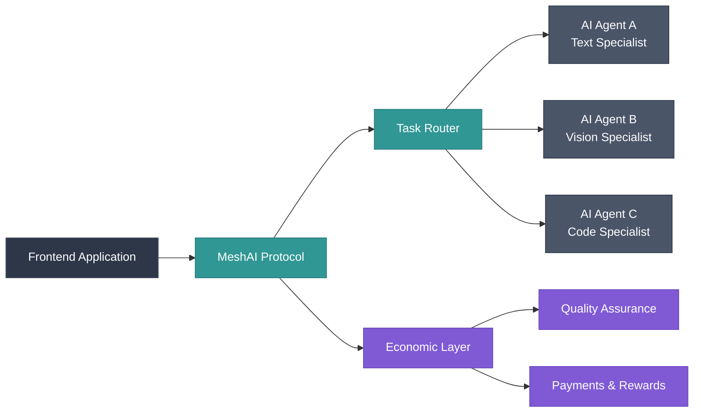

<Frame>


</Frame>

## What you'll learn

- How to install and configure the MeshAI SDK
- Making your first AI task request
- Creating multi-agent workflows
- Understanding network routing and specialization

## Prerequisites

- Node.js 18+ or Python 3.8+
- Basic understanding of AI/ML concepts
- API key from [MeshAI Dashboard](https://meshai.network/dashboard)

## Installation

<CodeGroup>

```bash npm
npm install meshai-sdk
```

```bash pip
pip install meshai-sdk
```

```bash yarn
yarn add meshai-sdk
```

</CodeGroup>

## Get your API Key

1. Sign up at [meshai.network/dashboard](https://meshai.network/dashboard)
2. Create a new project
3. Copy your API key from the dashboard
4. Add it to your environment variables:

```bash
export MESHAI_API_KEY="your_api_key_here"
```

<Warning>
Keep your API key secure and never commit it to version control. Use environment variables or a secure key management system.
</Warning>

## Your First Request

Let's start with a simple text generation task:

<CodeGroup>

```python Python
from meshai import MeshAI

# Initialize the client
client = MeshAI(api_key="your_api_key")

# Execute a simple task
result = client.execute_task(
    task_type="text_generation",
    input="Explain quantum computing in simple terms",
    quality_level="high"
)

print(result.output)
print(f"Processed by agent: {result.agent_id}")
print(f"Quality score: {result.quality_score}")
print(f"Cost: {result.cost} SOL")
```

```javascript JavaScript
import { MeshAI } from 'meshai-sdk';

// Initialize the client
const client = new MeshAI({ apiKey: 'your_api_key' });

// Execute a simple task
const result = await client.executeTask({
  taskType: 'text_generation',
  input: 'Explain quantum computing in simple terms',
  qualityLevel: 'high'
});

console.log(result.output);
console.log(`Processed by agent: ${result.agentId}`);
console.log(`Quality score: ${result.qualityScore}`);
console.log(`Cost: ${result.cost} SOL`);
```

</CodeGroup>

## Architecture

At its core, MeshAI Protocol connects applications with specialized AI agents using a decentralized federation protocol:



- **Frontend**: Your application that needs AI capabilities
- **MeshAI Protocol**: Federation layer that routes tasks and handles coordination
- **Task Router**: Intelligent system that selects optimal specialized agents
- **AI Agents**: Specialized services (text, vision, code, audio, etc.)
- **Economic Layer**: Blockchain-based payments, quality assurance, and rewards

## Understanding the Response

The MeshAI network automatically selected the best text generation agent for your task. The response includes:

- `output`: The AI-generated content
- `agent_id`: Which specialized agent processed your task
- `quality_score`: Confidence score from 0-1
- `cost`: Payment in SOL tokens
- `latency`: Processing time in milliseconds

<Info>
MeshAI routes tasks to specialized agents rather than using general-purpose models. This means better quality and lower costs for specific use cases.
</Info>

## Multi-Agent Workflows

Now let's create a more complex workflow that uses multiple specialized agents:

<CodeGroup>

```python Python
from meshai import MeshAI

client = MeshAI(api_key="your_api_key")

# Create a workflow
workflow = client.create_workflow(name="document_analysis")

# Step 1: OCR to extract text from image
ocr_task = workflow.add_task(
    task_type="document_ocr",
    input={"image_url": "https://example.com/document.jpg"},
    quality_threshold=0.99
)

# Step 2: Analyze sentiment (depends on OCR completing)
sentiment_task = workflow.add_task(
    task_type="sentiment_analysis",
    input=ocr_task.output,
    depends_on=ocr_task
)

# Step 3: Extract entities (runs in parallel with sentiment)
entities_task = workflow.add_task(
    task_type="entity_extraction",
    input=ocr_task.output,
    depends_on=ocr_task,
    parallel_to=sentiment_task
)

# Step 4: Generate summary (depends on all previous tasks)
summary_task = workflow.add_task(
    task_type="text_summarization",
    input={
        "text": ocr_task.output,
        "sentiment": sentiment_task.output,
        "entities": entities_task.output
    },
    depends_on=[ocr_task, sentiment_task, entities_task]
)

# Execute the entire workflow
results = await workflow.execute()

print("Workflow completed!")
print(f"Original text: {results['ocr_task'].output}")
print(f"Sentiment: {results['sentiment_task'].output}")
print(f"Entities: {results['entities_task'].output}")
print(f"Summary: {results['summary_task'].output}")
```

```javascript JavaScript
import { MeshAI } from 'meshai-sdk';

const client = new MeshAI({ apiKey: 'your_api_key' });

// Create a workflow
const workflow = client.createWorkflow({ name: 'document_analysis' });

// Step 1: OCR to extract text from image
const ocrTask = workflow.addTask({
  taskType: 'document_ocr',
  input: { imageUrl: 'https://example.com/document.jpg' },
  qualityThreshold: 0.99
});

// Step 2: Analyze sentiment (depends on OCR completing)
const sentimentTask = workflow.addTask({
  taskType: 'sentiment_analysis',
  input: ocrTask.output,
  dependsOn: ocrTask
});

// Step 3: Extract entities (runs in parallel with sentiment)
const entitiesTask = workflow.addTask({
  taskType: 'entity_extraction',
  input: ocrTask.output,
  dependsOn: ocrTask,
  parallelTo: sentimentTask
});

// Step 4: Generate summary (depends on all previous tasks)
const summaryTask = workflow.addTask({
  taskType: 'text_summarization',
  input: {
    text: ocrTask.output,
    sentiment: sentimentTask.output,
    entities: entitiesTask.output
  },
  dependsOn: [ocrTask, sentimentTask, entitiesTask]
});

// Execute the entire workflow
const results = await workflow.execute();

console.log('Workflow completed!');
console.log(`Original text: ${results.ocrTask.output}`);
console.log(`Sentiment: ${results.sentimentTask.output}`);
console.log(`Entities: ${results.entitiesTask.output}`);
console.log(`Summary: ${results.summaryTask.output}`);
```

</CodeGroup>

## How Network Routing Works

MeshAI automatically routes each task to the most suitable agent based on:

1. **Specialization**: Agents trained specifically for the task type
2. **Quality Score**: Historical performance and user ratings
3. **Latency**: Response time and geographic proximity
4. **Cost**: Competitive pricing from multiple agents
5. **Availability**: Current capacity and uptime

<Card title="Network Intelligence" icon="brain">
  The protocol learns from every task execution, continuously improving routing decisions to optimize for quality, speed, and cost.
</Card>

## Available Task Types

MeshAI supports a growing ecosystem of specialized AI capabilities:

| Task Type | Description | Example Use Case |
| --- | --- | --- |
| `text_generation` | Creative and technical writing | Blog posts, documentation |
| `text_analysis` | Sentiment, entities, classification | Content moderation, insights |
| `text_summarization` | Document and content summarization | Research, news digests |
| `document_ocr` | Text extraction from images/PDFs | Document digitization |
| `image_analysis` | Image captioning and classification | Content tagging, accessibility |
| `code_generation` | Programming assistance | Development automation |
| `translation` | Multi-language text translation | Localization, communication |
| `audio_transcription` | Speech-to-text conversion | Meeting notes, accessibility |

<Tip>
New task types are added regularly as more specialized agents join the network. Check the [Agent Directory](https://meshai.network/agents) for the latest capabilities.
</Tip>

## Error Handling

Handle common scenarios gracefully:

<CodeGroup>

```python Python
from meshai import MeshAI
from meshai.exceptions import (
    TaskTimeoutError, 
    InsufficientFundsError,
    QualityThresholdError,
    AgentUnavailableError
)

client = MeshAI(api_key="your_api_key")

try:
    result = client.execute_task(
        task_type="text_generation",
        input="Write a technical manual",
        quality_threshold=0.95,
        timeout=30000,
        max_cost=0.01
    )
    print(result.output)

except TaskTimeoutError:
    print("Task took too long to complete")

except InsufficientFundsError as e:
    print(f"Need {e.required_amount} SOL to complete task")

except QualityThresholdError as e:
    print(f"Result quality {e.actual_quality} below threshold {e.threshold}")

except AgentUnavailableError:
    print("No agents currently available for this task type")

except Exception as e:
    print(f"Unexpected error: {e}")
```

```javascript JavaScript
import { MeshAI, MeshAIError } from 'meshai-sdk';

const client = new MeshAI({ apiKey: 'your_api_key' });

try {
  const result = await client.executeTask({
    taskType: 'text_generation',
    input: 'Write a technical manual',
    qualityThreshold: 0.95,
    timeout: 30000,
    maxCost: 0.01
  });
  console.log(result.output);

} catch (error) {
  if (error instanceof MeshAIError) {
    switch (error.code) {
      case 'TASK_TIMEOUT':
        console.log('Task took too long to complete');
        break;
      case 'INSUFFICIENT_FUNDS':
        console.log(`Need ${error.requiredAmount} SOL to complete task`);
        break;
      case 'QUALITY_THRESHOLD':
        console.log(`Result quality ${error.actualQuality} below threshold`);
        break;
      case 'AGENT_UNAVAILABLE':
        console.log('No agents currently available for this task type');
        break;
      default:
        console.log(`MeshAI error: ${error.message}`);
    }
  } else {
    console.log(`Unexpected error: ${error.message}`);
  }
}
```

</CodeGroup>

## Configuration Options

Customize the client behavior for your needs:

<CodeGroup>

```python Python
from meshai import MeshAI

client = MeshAI(
    api_key="your_api_key",
    network="mainnet",  # or "testnet" for development
    config={
        "timeout": 30000,           # Default timeout in ms
        "retry_attempts": 3,        # Retry failed requests
        "quality_threshold": 0.8,   # Minimum quality score
        "max_cost": 0.1,           # Maximum cost per task in SOL
        "preferred_regions": ["us-east", "eu-west"],
        "enable_caching": True,     # Cache similar requests
        "log_level": "info"         # Logging verbosity
    }
)
```

```javascript JavaScript
import { MeshAI } from 'meshai-sdk';

const client = new MeshAI({
  apiKey: 'your_api_key',
  network: 'mainnet', // or 'testnet' for development
  config: {
    timeout: 30000,           // Default timeout in ms
    retryAttempts: 3,         // Retry failed requests
    qualityThreshold: 0.8,    // Minimum quality score
    maxCost: 0.1,            // Maximum cost per task in SOL
    preferredRegions: ['us-east', 'eu-west'],
    enableCaching: true,      // Cache similar requests
    logLevel: 'info'          // Logging verbosity
  }
});
```

</CodeGroup>

## Monitoring and Analytics

Track your usage and optimize costs:

<CodeGroup>

```python Python
# Get usage statistics
stats = client.get_usage_stats(period="last_30_days")
print(f"Total tasks: {stats.total_tasks}")
print(f"Total cost: {stats.total_cost} SOL")
print(f"Average quality: {stats.average_quality}")
print(f"Most used task type: {stats.top_task_type}")

# Get detailed task history
history = client.get_task_history(limit=10)
for task in history:
    print(f"{task.timestamp}: {task.task_type} - {task.status}")
```

```javascript JavaScript
// Get usage statistics
const stats = await client.getUsageStats({ period: 'last_30_days' });
console.log(`Total tasks: ${stats.totalTasks}`);
console.log(`Total cost: ${stats.totalCost} SOL`);
console.log(`Average quality: ${stats.averageQuality}`);
console.log(`Most used task type: ${stats.topTaskType}`);

// Get detailed task history
const history = await client.getTaskHistory({ limit: 10 });
history.forEach(task => {
  console.log(`${task.timestamp}: ${task.taskType} - ${task.status}`);
});
```

</CodeGroup>

## Next Steps

<CardGroup cols={2}>
  <Card title="SDK Documentation" icon="code" href="/sdk/python">
    Complete API reference and advanced features
  </Card>
  <Card title="Agent Development" icon="robot" href="/agents/join">
    Build and monetize your own AI agents
  </Card>
  <Card title="Use Case Examples" icon="lightbulb" href="/examples">
    Real-world implementations and patterns
  </Card>
  <Card title="Network Dashboard" icon="chart-line" href="https://meshai.network/dashboard">
    Monitor usage, costs, and performance
  </Card>
</CardGroup>

## Support

<AccordionGroup>
  <Accordion title="Getting Help">
    - **Documentation**: Complete guides and API reference
    - **Discord**: Active community support channel
    - **GitHub**: Open source examples and issue tracking
    - **Email**: team@meshai.network for technical support
  </Accordion>
  
  <Accordion title="Common Issues">
    **Authentication Errors**: Verify your API key is correct and active
    
    **Task Failures**: Check network status and try different agents
    
    **High Costs**: Adjust quality thresholds and use task-specific agents
    
    **Slow Performance**: Consider geographic routing preferences
  </Accordion>
  
  <Accordion title="Best Practices">
    - Set appropriate quality thresholds for your use case
    - Use workflows for complex multi-step processes
    - Monitor costs and optimize agent selection
    - Handle errors gracefully in production applications
    - Cache results when appropriate to reduce costs
  </Accordion>
</AccordionGroup>